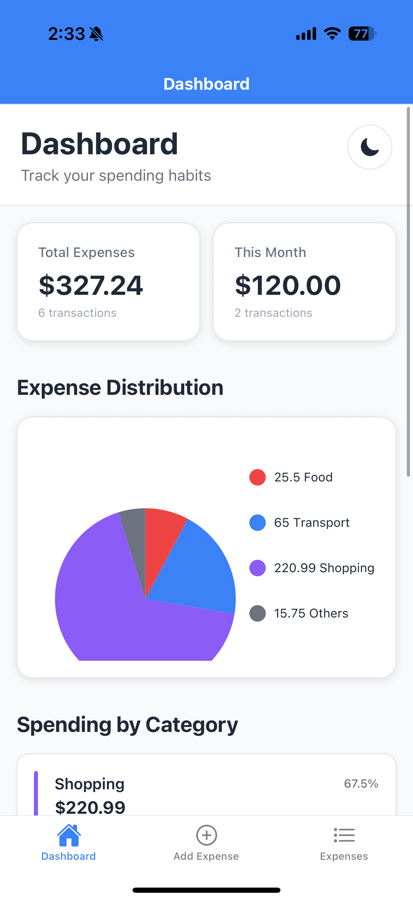
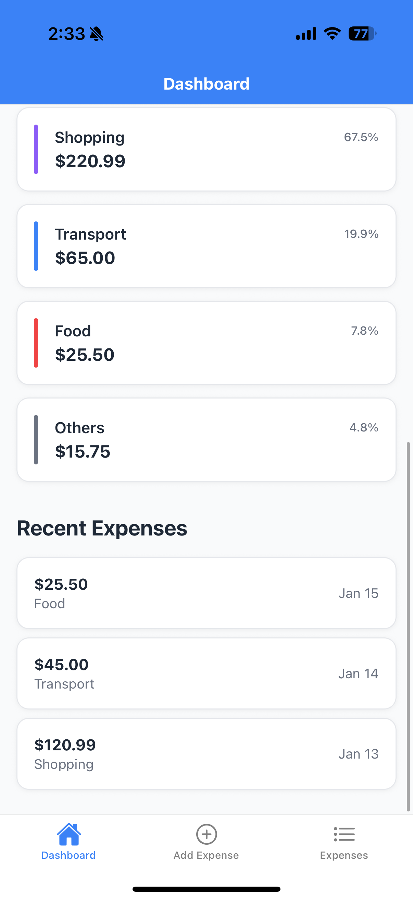
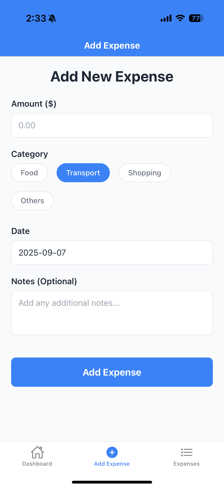
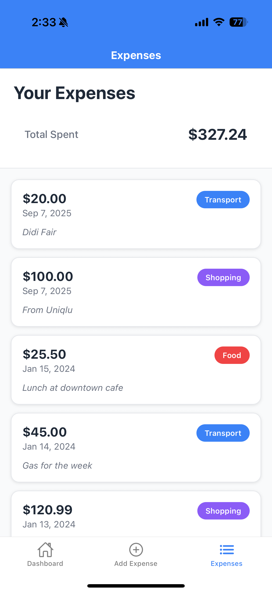

# 💰 Expense Tracker App

A modern React Native expense tracking application built with Expo, featuring beautiful UI, dark mode support, and interactive charts.

## ✨ Features

### 📊 **Dashboard**

- Interactive pie chart showing expense distribution by category
- Total expenses and monthly spending summary
- Category breakdown with percentages and color indicators
- Recent expenses preview
- Light/Dark mode toggle

### ➕ **Add Expenses**

- Clean form interface with validation
- Category selection (Food, Transport, Shopping, Others)
- Date picker with current date pre-filled
- Optional notes field
- Keyboard-aware scrolling for better UX

### 📋 **Expense List**

- Scrollable list of all expenses
- Color-coded category badges
- Pull-to-refresh functionality
- Total spending summary
- Dummy data loaded automatically when no expenses exist

### 🌙 **Theme Support**

- Light and Dark mode with system preference detection
- Theme preferences saved locally
- Consistent theming across all screens
- Smooth theme transitions

## 🛠 Tech Stack

- **Framework**: React Native with Expo
- **Navigation**: React Navigation (Bottom Tabs)
- **Charts**: React Native Chart Kit
- **Storage**: AsyncStorage for local data persistence
- **Styling**: React Native StyleSheet (Tailwind-inspired)
- **Icons**: Expo Vector Icons (Ionicons)

## 📱 Screenshots

<div align="center">
  <table>
    <tr>
      <td align="center">
        
        <br/>
        <b>Dashboard - 1</b>
        <br/>
        <em>Expense summary & pie chart</em>
      </td>
      <td align="center">
        
        <br/>
        <b>Dashboard - 2</b>
        <br/>
        <em>Category breakdown and recent activity</em>
      </td>
      <td align="center">
        
        <br/>
        <b>Add Expense</b>
        <br/>
        <em>Clean form interface</em>
      </td>
      <td align="center">
        
        <br/>
        <b>Expense List</b>
        <br/>
        <em>Category badges & pull-to-refresh</em>
      </td>
    </tr>
  </table>
</div>

## 🚀 Getting Started

### Prerequisites

- Node.js (v14 or higher)
- npm or yarn
- Expo CLI
- iOS Simulator or Android Emulator (optional)
- Expo Go app on your mobile device

### Installation

1. **Clone the repository**

   ```bash
   git clone <repository-url>
   cd ExpenseTrackerApp
   ```

2. **Install dependencies**

   ```bash
   npm install
   ```

3. **Start the development server**

   ```bash
   npx expo start
   ```

4. **Run the app**
   - Scan the QR code with Expo Go app on your phone
   - Press `i` for iOS simulator
   - Press `a` for Android emulator
   - Press `w` for web browser

## 📦 Dependencies

### Core Dependencies

```json
{
  "@react-navigation/bottom-tabs": "^6.x.x",
  "@react-navigation/native": "^6.x.x",
  "@react-native-async-storage/async-storage": "^1.x.x",
  "react-native-chart-kit": "^6.x.x",
  "react-native-svg": "^13.x.x",
  "react-native-appearance": "^0.x.x",
  "react-native-screens": "^3.x.x",
  "react-native-safe-area-context": "^4.x.x",
  "react-native-reanimated": "^3.x.x"
}
```

## 📁 Project Structure

```
ExpenseTrackerApp/
├── src/
│   ├── context/
│   │   └── ThemeContext.js          # Theme management
│   ├── navigation/
│   │   └── BottomTabNavigator.js    # Tab navigation setup
│   └── screens/
│       ├── DashboardScreen.js       # Main dashboard with charts
│       ├── AddExpenseScreen.js      # Expense form
│       └── ExpenseListScreen.js     # Expense list view
├── assets/                          # App icons and images
├── App.js                          # Main app component
├── babel.config.js                 # Babel configuration
└── package.json                    # Dependencies and scripts
```

## 💾 Data Structure

### Expense Object

```javascript
{
  id: "unique-timestamp-id",
  amount: 25.50,
  category: "Food", // Food | Transport | Shopping | Others
  date: "2024-01-15",
  notes: "Optional notes",
  createdAt: "2024-01-15T12:30:00.000Z"
}
```

### Storage

- Expenses are stored locally using AsyncStorage
- Theme preferences are persisted across app restarts
- Dummy data is automatically loaded for new users

## 🎨 Theming

The app supports both light and dark themes with:

- **Dynamic Colors**: All components adapt to the current theme
- **Category Colors**: Consistent color coding for expense categories
- **System Integration**: Respects system theme preferences
- **Manual Toggle**: Users can manually switch themes

### Theme Colors

```javascript
// Light Mode
colors: {
  background: '#ffffff',
  surface: '#f9fafb',
  text: '#1f2937',
  primary: '#3b82f6'
}

// Dark Mode
colors: {
  background: '#111827',
  surface: '#1f2937',
  text: '#f9fafb',
  primary: '#60a5fa'
}
```

## 📊 Charts & Analytics

- **Pie Chart**: Visual breakdown of expenses by category
- **Percentages**: Category spending percentages
- **Monthly Summary**: Current month vs total spending
- **Recent Activity**: Last 3 expenses preview

## 🔧 Configuration

### Customizing Categories

Edit the `CATEGORIES` array in `AddExpenseScreen.js`:

```javascript
const CATEGORIES = ["Food", "Transport", "Shopping", "Others"];
```

### Modifying Colors

Update theme colors in `src/context/ThemeContext.js`:

```javascript
const lightColors = {
  categoryFood: "#ef4444",
  categoryTransport: "#3b82f6",
  // ... other colors
};
```

## 🐛 Troubleshooting

### Common Issues

1. **Metro bundler cache issues**

   ```bash
   npx expo start --clear
   ```

2. **Module resolution errors**

   ```bash
   rm -rf node_modules
   npm install
   ```

3. **iOS simulator not opening**

   - Ensure Xcode is installed
   - Check iOS simulator is available

4. **Android emulator issues**
   - Verify Android Studio setup
   - Check emulator is running

## 🤝 Contributing

1. Fork the repository
2. Create a feature branch (`git checkout -b feature/amazing-feature`)
3. Commit your changes (`git commit -m 'Add amazing feature'`)
4. Push to the branch (`git push origin feature/amazing-feature`)
5. Open a Pull Request

## 📄 License

This project is licensed under the MIT License - see the [LICENSE](LICENSE) file for details.

## 🙏 Acknowledgments

- **Expo Team** for the amazing development platform
- **React Navigation** for seamless navigation
- **React Native Chart Kit** for beautiful charts
- **Ionicons** for the icon set

## 📞 Support

If you encounter any issues or have questions:

1. Check the troubleshooting section
2. Search existing issues
3. Create a new issue with detailed information

---

**Built with ❤️ using React Native and Expo**
